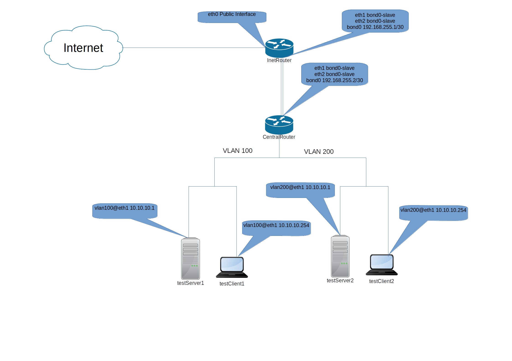

##### Схема сети


Для поднятия стэнда необходимо запустить:
``` bash
vagrant up && ansible-playbook playbooks/prep_stand_LACP_VLANs.yml
```
##### 1.LACP
После поднятия стэнда проверяем работу LACP


Отключаем интерфейс eth1 на хосте centralRouter


Видим что пакеты продолжают идти  
Поднимаем eth1 и отключаем eth2


##### 2. VLANs

Проверяем интерфейсы на хостах


Запускаем tcpdump на хостах testServer1 и testServer2  
Так же запускае ping с хостов testClient1 и testClient2

